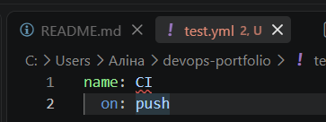

# Звіт з лабораторної роботи 1

## Завдання 1. Git і редактор

Чому значення core.autocrlf різне для Windows і Unix і що станеться, якщо його не задати?

Різні операційні системи по-різному позначають кінець рядка у файлах. Windows використовує два символи — CRLF (\r\n), а Unix-подібні системи (macOS, Linux) використовують один — LF (\n).
Якщо в команді розробників зі змішаними ОС не налаштувати core.autocrlf, Git буде бачити зміну символу кінця рядка як зміну всього коду. Якщо розробник на Windows збереже файл і відправить його, усі рядки зміняться на CRLF. Коли розробник на Linux стягне цей код, його Git покаже, що змінено кожен рядок у файлі, що призведе до гігантських нечитабельних diff-ів та постійних конфліктів при злитті. На Windows значення true автоматично конвертує LF у CRLF при завантаженні коду і навпаки при збереженні.

Чим історія з pull.rebase=true відрізняється від типової?

Типовий git pull за замовчуванням виконує злиття (merge). Якщо ви зробили локальний коміт, і хтось інший теж зробив коміт на сервері, типовий pull створить додатковий "merge-коміт", щоб об'єднати ці гілки. Це робить історію комітів заплутаною і схожою на павутину.
Увімкнений параметр pull.rebase=true змінює цю поведінку: замість злиття Git тимчасово "відкладає" ваші локальні коміти, завантажує нові зміни з сервера, а потім "накладає" ваші коміти поверх них. Це забезпечує ідеально пряму (лінійну) та чисту історію проєкту без зайвих комітів злиття.

**Глобальні параметри Git:**
Перевірка: вивід git config --list --global у звіті.
```text
user.name=Alina Skrypa
user.email=skrypa.alina@gmail.com
credential.helper=manager
init.defaultbranch=main
core.autocrlf=true
core.editor=code --wait
pull.rebase=true

``` 
Налаштувати VS Code або інший редактор (JetBrains, Neovim) для роботи з інфраструктурним кодом. Потрібні розширення для:
